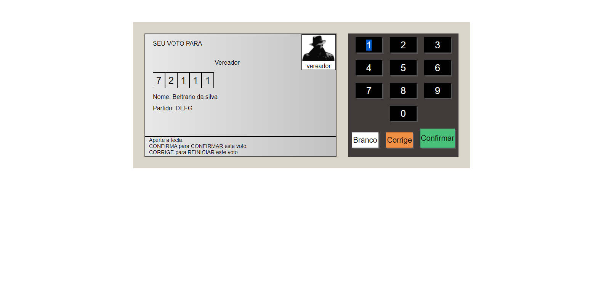

# Projeto Triplo

## Urna Eletrônica

### Urna Eletrônica desenvolvida em __JAVASCRIPT__, __HTML__ __CSS__.

### Este é o primeiros dos 3 projetos em 1 que sera desenvolvido aqui, os outros já estão sendo feitos.

## Este projeto tem a função de simular o basico de uma urna eletronica, como voto nulo, voto em branco, corrigir e confirmar voto. A utilizado dois cargos politicos, como Vereador Prefeito com seu Vice.
